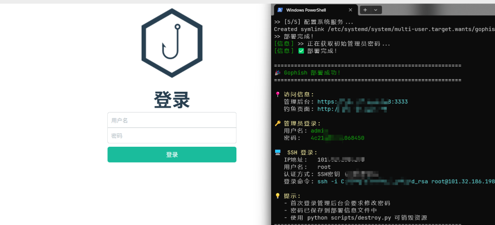

# PhishOps

<div align="center">


**快速部署 Gophish 二开增强版到云端**

基于 [GophishModified](https://github.com/25smoking/GophisModified) 定制版本

[English](README_EN.md) | [日本語](README_JP.md)

</div>



---

## 📖 项目简介

**PhishOps** 是一款 Gophish 自动化部署工具，可基于 CI/CD 流一键部署增强版 GophishModified 平台，解决搭建繁琐痛点，大幅提升成本利用率。

> 💡 **关于 GophishModified**  
> 本项目部署的是 [GophishModified](https://github.com/25smoking/GophisModified) 二开版本，包含以下增强功能：
> - QR 码生成功能（灵感来自 EvilGophish）
> - 更多自定义功能...

### ✨ 核心特性

- **🚀 一键部署** - 全自动基础设施配置和应用部署，3 分钟内完成
- **☁️ 腾讯云优化** - 完整测试并优化的腾讯云部署方案（香港、广州等节点）
- **🔄 GitOps 工作流** - 从 GitHub 仓库持续交付，支持分支切换
- **🎨 功能增强** - 基于 GophishModified 的二开功能
- **🔒 安全优先** - 自动防火墙配置、HTTPS 支持、密码自动生成
- **💾 智能备份** - 资源销毁前自动备份数据库到本地
- **📊 成本透明** - 实时资源监控和成本估算

### 🎯 使用场景

- **安全意识培训** - 企业员工钓鱼邮件识别培训
- **攻防演练** - 红蓝对抗、应急响应演练
- **渗透测试** - 社会工程学测试场景
- **安全研究** - 钓鱼技术研究和防御机制验证

---

## 🛠️ 环境准备

### 1. 腾讯云账号

获取腾讯云 API 访问密钥：

- **腾讯云控制台**: [API 密钥管理](https://console.cloud.tencent.com/cam/capi)
- **推荐地域**: 
  - `ap-hongkong` - 香港（国际）
  - `ap-guangzhou` - 广州（国内）
  - `ap-shanghai` - 上海（国内）

> 💡 **实验性支持**  
> 本项目**已完整测试腾讯云**部署流程。~~阿里云和华为云的配置文件已准备，但尚未经过完整测试，如需使用请自行测试验证。~~


### 2. 本地工具安装

**使用 Chocolatey 一键安装（推荐）**

1. 以**管理员身份**打开 PowerShell
2. 安装 Chocolatey（如果尚未安装）：
   ```powershell
   Set-ExecutionPolicy Bypass -Scope Process -Force
   [System.Net.ServicePointManager]::SecurityProtocol = [System.Net.ServicePointManager]::SecurityProtocol -bor 3072
   iex ((New-Object System.Net.WebClient).DownloadString('https://community.chocolatey.org/install.ps1'))
   ```

3. 一键安装所有依赖：
   ```powershell
   choco install python terraform git openssh -y
   ```

4. 验证安装：
   ```powershell
   python --version    # 应显示 Python 3.8+
   terraform -v        # 应显示 Terraform 1.0+
   git --version       # 应显示 Git 版本
   ssh -V             # 应显示 OpenSSH 版本
   ```

---

## 🚀 快速开始

### 步骤 1：克隆项目

```bash
git clone https://github.com/yourusername/phishops.git
cd phishops
```

### 步骤 2：配置云平台凭证

```powershell
# 复制配置模板
copy configs\.env.example configs\.env

# 编辑配置文件
notepad configs\.env
```

**配置示例：**

```ini
# 腾讯云
TENCENT_CLOUD_SECRET_ID=your_secret_id
TENCENT_CLOUD_SECRET_KEY=your_secret_key

# 可选：指定可用区（如果遇到资源不足问题）
# TENCENT_CLOUD_AVAILABILITY_ZONE=ap-hongkong-3

# 可选：自定义 SSH 密钥路径（默认使用 ~/.ssh/id_rsa）
# SSH_KEY_PATH=$HOME/.ssh/id_rsa
```

> ⚠️ **Windows 用户注意**  
> 在 Windows 上，路径中的 `$HOME` 会自动展开为你的用户目录（例如 `C:\Users\YourName`）

### 步骤 3：一键部署

**部署到腾讯云（香港）**
```powershell
python scripts/deploy.py -p tencent -r ap-hongkong
```

**部署到腾讯云（广州）**
```powershell
python scripts/deploy.py -p tencent -r ap-guangzhou
```

**部署指定 GitHub 分支**
```powershell
python scripts/deploy.py -p tencent -r ap-hongkong -b master
```

> 💡 **其他云平台**  
> 如需部署到阿里云或华为云，请参考代码中的配置示例并自行测试：
> ```powershell
> # 阿里云（实验性）
> python scripts/deploy.py -p alibaba -r cn-shanghai
> 
> # 华为云（实验性）
> python scripts/deploy.py -p huawei -r cn-north-1
> ```

### 步骤 4：等待部署完成

脚本会自动完成以下操作（约 3-5 分钟）：

1. ✅ 创建云基础设施（VPC、安全组、云服务器）
2. ✅ 等待 SSH 服务就绪
3. ✅ 安装 Docker 和 Go 环境
4. ✅ 从 GitHub 拉取源码并编译
5. ✅ 配置外网访问（监听 0.0.0.0）
6. ✅ 启动 Gophish 服务

**部署成功后显示：**

```text
========================================================
🎉 Gophish 部署成功！
========================================================

📍 访问信息:
   管理后台: https://1.2.3.4:3333
   钓鱼页面: http://1.2.3.4

🔑 管理员登录:
   用户名: admin
   密码:   a1b2c3d4e5f6

🖥️  SSH 登录:
   命令: ssh -i ~/.ssh/id_rsa root@1.2.3.4

💰 预估成本: ¥0.15/小时 (约 ¥108/月)
========================================================
```

---

## 📊 部署架构

### 自动创建的云资源

```
┌─────────────────────────────────────────┐
│          互联网 (Internet)              │
└────────────┬────────────────────────────┘
             │
             │ HTTPS:3333 (管理后台)
             │ HTTP:80    (钓鱼页面)
             │ SSH:22     (远程管理)
             │
┌────────────▼────────────────────────────┐
│   安全组 (Security Group)               │
│   - 开放 22/80/3333 端口                │
└────────────┬────────────────────────────┘
             │
┌────────────▼────────────────────────────┐
│   VPC 私有网络 (172.16.0.0/16)          │
│                                         │
│   ┌─────────────────────────────────┐   │
│   │  云服务器 (2核4G, Ubuntu 22.04) │   │
│   │                                 │   │
│   │  ┌───────────────────────────┐  │   │
│   │  │   Gophish Application     │  │   │
│   │  │   - 管理后台 :3333        │  │   │
│   │  │   - 钓鱼服务 :80          │  │   │
│   │  │   - SQLite 数据库         │  │   │
│   │  └───────────────────────────┘  │   │
│   │                                 │   │
│   │  ┌───────────────────────────┐  │   │
│   │  │   Runtime Environment     │  │   │
│   │  │   - Docker 24.0+          │  │   │
│   │  │   - Go 1.21+              │  │   │
│   │  └───────────────────────────┘  │   │
│   └─────────────────────────────────┘   │
└─────────────────────────────────────────┘
```

---

## 💻 管理与维护

### 查看资源状态

```powershell
python scripts/check-resources.py
```

输出示例：
```text
当前云平台: Tencent Cloud (ap-hongkong)
服务器状态: Running
公网 IP:    43.xxx.xxx.xxx
运行时间:   2小时15分钟
预估费用:   ¥0.32
```

### SSH 远程登录

```bash
# 使用自动生成的密钥登录
ssh -i ~/.ssh/id_rsa root@<服务器IP>

# 查看 Gophish 日志
journalctl -u gophish -f
```

### 重启 Gophish 服务

```bash
systemctl restart gophish
```

### 常见问题排查

#### 1. 无法访问管理后台（3333 端口）

**检查清单：**
- ✅ 确认安全组已开放 3333 端口（Terraform 默认已配置）
- ✅ 确认 Gophish 服务正在运行：`systemctl status gophish`
- ✅ 检查服务器监听地址：`netstat -tlnp | grep 3333`

**解决方法：**
```bash
# 手动修改配置
cd /root/gophish
nano config.json  # 确保 admin_server.listen_url 为 "0.0.0.0:3333"
systemctl restart gophish
```

#### 2. 静态资源缺失（CSS/JS 404）

这通常是因为 GitHub 仓库中的静态文件路径与模板引用不一致。

**检查路径：**
```bash
ls -la /root/gophish/static/css/dist/
ls -la /root/gophish/static/js/dist/
```

**同步文件：**
确保本地仓库的 `static/` 目录结构与线上一致后，重新推送到 GitHub，然后重新部署。

#### 3. 部署失败：Terraform 超时

腾讯云可能需要指定可用区：

```ini
# 在 configs/.env 中添加
TENCENT_CLOUD_AVAILABILITY_ZONE=ap-hongkong-3
```

---

## 🗑️ 销毁资源

### 标准销毁（含备份）

```powershell
python scripts/destroy.py -p tencent
```

**执行流程：**
1. 提示确认销毁操作
2. 自动备份数据库到 `backups/` 目录
3. 销毁所有云资源（服务器、VPC、安全组）
4. 清理本地 Terraform 状态文件

### 强制销毁（跳过确认）

```powershell
python scripts/destroy.py -p tencent --force
```

### ⚠️ 重要提示

> **销毁可能卡死的解决方案**  
> 如果 `terraform destroy` 命令长时间无响应或卡死：
> 
> 1. **按 `Ctrl+C` 中断脚本**
> 2. **前往云控制台手动删除资源**：
>    - 腾讯云：[云服务器控制台](https://console.cloud.tencent.com/cvm/instance)
>    - 删除顺序：实例 → 安全组 → VPC
> 3. **清理本地状态**：
>    ```powershell
>    cd terraform/tencent
>    rm -rf .terraform terraform.tfstate*
>    ```

⚠️ **注意：** 销毁操作不可逆，请确保已备份重要数据！

---

## 💰 成本估算

### 按小时计费（实际使用时长）

| 云平台 | 实例规格 | 小时费用 | 月费用（720小时） |
|--------|----------|---------|-------------------|
| 腾讯云 | SA2.MEDIUM4 (2核4G) | ¥0.15/小时 | ¥108/月 |

> 💡 **省钱技巧：** 演练结束后立即销毁资源，按实际使用时长计费（例如使用 2 小时仅需 ¥0.30）


---

## 📚 项目结构

```
phishops/
├── configs/              # 配置文件
│   ├── .env.example     # 配置模板
│   └── .env             # 实际配置
├── scripts/              # 自动化脚本
│   ├── deploy.py        # 部署脚本
│   ├── destroy.py       # 销毁脚本
│   └── check-resources.py # 资源检查脚本
├── terraform/            # Terraform 配置
│   ├── alibaba/         # 阿里云配置
│   ├── tencent/         # 腾讯云配置
│   └── huawei/          # 华为云配置
├── backups/              # 数据库备份目录
└── README.md             # 本文档
```

---

## 🔧 高级配置

### 自定义实例规格

编辑对应云平台的 Terraform 配置文件：

```hcl
# terraform/tencent/main.tf
resource "tencentcloud_instance" "gophish" {
  instance_type = "SA2.LARGE8"  # 改为 4核8G
  # ...
}
```

### 使用自定义域名

1. 在 DNS 提供商处添加 A 记录指向服务器 IP
2. 修改 Gophish 配置文件中的 `phish_server.listen_url`
3. 配置 SSL 证书（可使用 Let's Encrypt）

---

## ⚠️ 免责声明

本工具**仅用于授权的安全测试和教育目的**。使用本工具的用户需：

- ✅ 获得目标系统所有者的明确书面授权
- ✅ 遵守所在国家/地区的法律法规
- ✅ 不得用于任何非法或恶意活动
- ✅ 对自己的行为及其后果承担全部责任

**未经授权的钓鱼攻击是违法行为，作者不对滥用行为承担任何责任。**

---

## 📄 开源协议

本项目采用 [MIT License](LICENSE) 许可证。

---

## 🤝 贡献指南

欢迎提交 Issue 和 Pull Request！

1. Star 本项目
2. Fork 本项目
3. 创建特性分支 (`git checkout -b feature/new-feature`)
4. 提交更改 (`git commit -m 'Add new feature'`)
5. 推送到分支 (`git push origin feature/new-feature`)
6. 开启 Pull Request

---

## 📞 联系方式

- **项目主页**: [https://github.com/25smoking/PhishOps](https://github.com/25smoking/PhishOps)
- **问题反馈**: [GitHub Issues](https://github.com/25smoking/PhishOps/issues)

---

<div align="center">

**如果这个项目对你有帮助，请给个 ⭐ Star 支持一下！**

Made with ❤️ by Security Researchers

</div>
